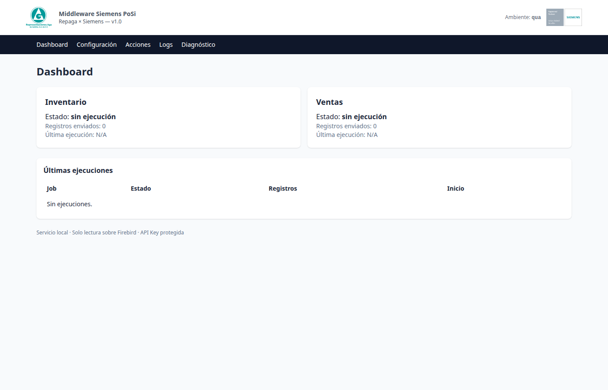
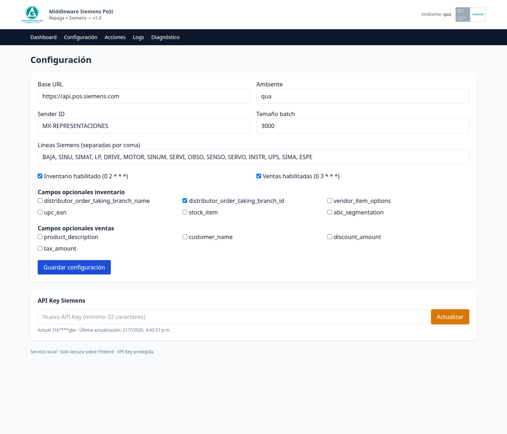
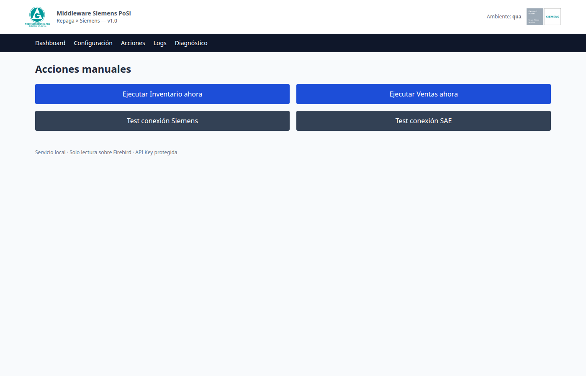
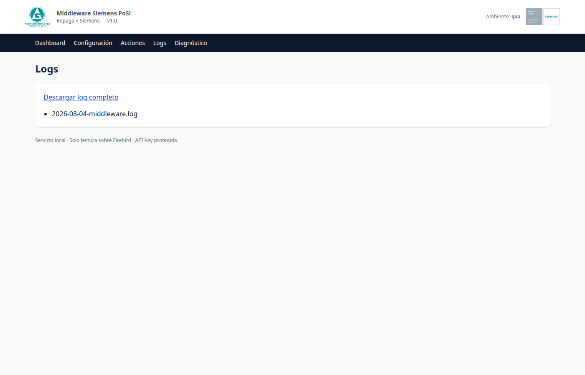
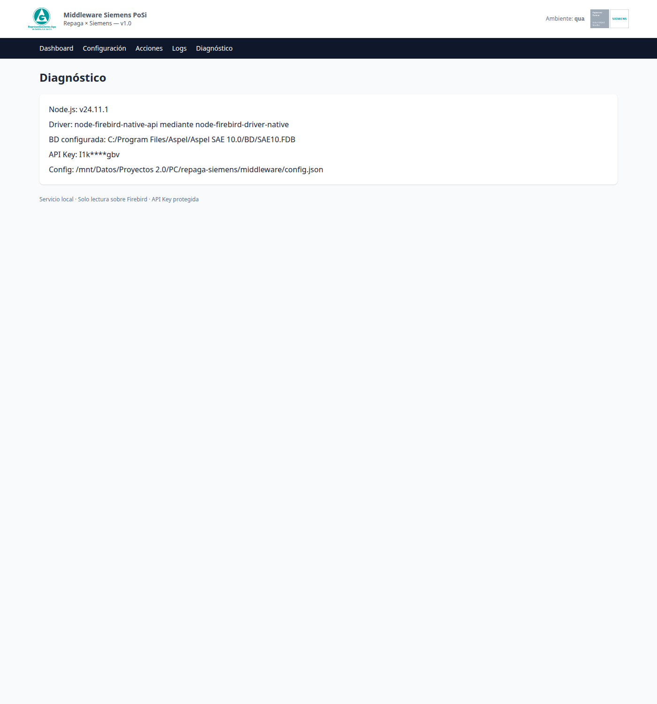

# Manual de Usuario — Middleware Repaga × Siemens PoSi

**Para:** Ing. Francisco Aguirre — Representaciones Aga de Saltillo
**Aplicación:** Valueflow Middleware v1.0
**Sistema origen:** Aspel SAE 10 (Firebird 5.0)
**Sistema destino:** Siemens PoSi Portal

---

## 📖 ¿Qué es este software?

Este software conecta su sistema **Aspel SAE 10** con el portal **Siemens PoSi**, enviando **automáticamente** todos los días:

- 📦 Su **inventario** (productos marca Siemens) a las **02:00 AM**
- 💰 Sus **ventas** (facturas con productos marca Siemens) a las **03:00 AM**

Todo esto **sin que usted tenga que hacer nada**. El sistema corre como un servicio de Windows en su PC y trabaja en segundo plano.

**Usted solo necesita saber cómo abrir la interfaz, ver si todo está bien, y cambiar la contraseña de Siemens cuando se lo pidan.**

---

## 🚀 Cómo abrir el sistema

### Paso 1 — Abrir el navegador

1. Abra **Google Chrome** o **Microsoft Edge** (cualquier navegador moderno)
2. En la barra de direcciones escriba exactamente:

   ```
   http://localhost:4567
   ```

3. Presione **Enter**

> 💡 **¿Qué es "localhost"?** Es la dirección de su propia computadora. No abre internet, solo el programa que está instalado en su PC.

### Paso 2 — Iniciar sesión

La primera vez le pedirá usuario y contraseña:

| Campo | Valor |
|-------|-------|
| **Usuario** | `admin` |
| **Contraseña** | La que se configuró durante la instalación |

> Si olvidó la contraseña, contacte a su proveedor (VCorp).

Una vez dentro, verá un menú oscuro con 5 opciones en la parte superior:
- **Dashboard**
- **Configuración**
- **Acciones**
- **Logs**
- **Diagnóstico**

Vamos a ver cada una.

---

## 📊 Pantalla 1 — Dashboard (la principal)



### ¿Qué es?

Es la pantalla de inicio. Le muestra **de un vistazo** si todo está funcionando bien.

### ¿Qué muestra?

1. **Logos en la parte superior**
   - Logo de **Representaciones Aga** (izquierda)
   - Sello de **Siemens Approved Partner** (derecha, con el ambiente actual: QUA o PRD)

2. **Dos tarjetas grandes** — estado de cada trabajo automático:
   - **Inventario** (envía a las 02:00 AM)
   - **Ventas** (envía a las 03:00 AM)
   
   Cada tarjeta muestra:
   - 🟢 **Estado:** `correcto` (verde) o `con error` (rojo) o `sin ejecución` (gris)
   - **Registros enviados:** cuántos productos o facturas se enviaron
   - **Última ejecución:** fecha y hora de la última vez que corrió

3. **Tabla "Últimas ejecuciones":** historial de los últimos 10 envíos, con su estado.

4. **Pie de página:** "Servicio local · Solo lectura sobre Firebird · API Key protegida" — esto significa que el programa **NO modifica** su sistema Aspel, solo lee.

### ¿Cuándo revisarla?

- Una vez al día, por la mañana, para confirmar que la noche anterior se enviaron los datos sin errores.
- Si el área de Siemens le avisa que no recibió información.

### 🟢 Estado normal

Si ve esto, todo está bien:
- Las dos tarjetas dicen **"correcto"** (verde)
- La tabla muestra ejecuciones de hoy y ayer con estado OK

### 🔴 Estado con problemas

Si ve **"con error"** (rojo) o "sin ejecución" (gris):
1. Vaya a la pestaña **"Logs"** (la cuarta opción del menú)
2. Anote la fecha y hora de la última ejecución con error
3. Contacte a soporte

---

## ⚙️ Pantalla 2 — Configuración



### ¿Qué es?

Aquí se cambian los **datos de conexión** del sistema. **No la use a menos que se lo pida el soporte o cambie la contraseña de Siemens.**

### ¿Qué muestra?

**Bloque 1 — Identidad de Siemens:**
- **Base URL:** la dirección del portal de Siemens (no cambiar)
- **Ambiente:** QUA (pruebas) o PRD (producción real)
- **Sender ID:** el identificador único de su empresa (no cambiar)
- **Tamaño batch:** cantidad máxima de registros por envío (3000 está bien)

**Bloque 2 — Líneas Siemens:**
Lista de las 15 líneas de producto que se consideran "marca Siemens":
`BAJA, SINU, SIMAT, LP, DRIVE, MOTOR, SINUM, SERVI, OBSO, SENSO, SERVO, INSTR, UPS, SIMA, ESPE`

> Si Siemens agrega una nueva línea de producto, se puede agregar aquí.

**Bloque 3 — Trabajos automáticos:**
- ☑️ **Inventario habilitado** (corre a las 02:00 AM)
- ☑️ **Ventas habilitadas** (corre a las 03:00 AM)
- ☐ Si los desmarca, ese trabajo deja de correr automáticamente

**Bloque 4 — Campos opcionales:**
Información extra que se puede enviar o no. Por defecto todos están apagados. **No los active a menos que Siemens se los pida.**

**Bloque 5 — API Key Siemens (MUY IMPORTANTE):**
Aquí se cambia la **contraseña de Siemens** sin reiniciar nada.

### 🔐 Cómo cambiar la contraseña de Siemens (cuando se la pidan)

1. **No** cambie el resto de la pantalla
2. Baje hasta el bloque **"API Key Siemens"**
3. Haga clic en el campo de texto (que dice "Nueva API Key (mínimo 32 caracteres)")
4. **Pegue** la nueva clave que le dio Siemens (Ctrl+V)
5. Haga clic en el botón naranja **"Actualizar"**
6. Espere unos segundos — el sistema valida automáticamente

**Después de actualizar:** la próxima vez que el sistema envíe información (02:00 o 03:00 AM), usará la nueva clave automáticamente. No se reinicia nada.

> 🔒 **Seguridad:** la clave nunca se muestra completa, solo enmascarada (ejemplo: `I1k****gbv`).

### ⏰ Cómo cambiar los horarios

Si necesita que el inventario o las ventas corran a otra hora:

1. Cambie el campo **"Inventario habilitado"** o **"Ventas habilitadas"** (use formato de Linux: `0 2 * * *` = a las 02:00 AM todos los días)
2. **Mejor:** pida a soporte que lo haga por usted para evitar errores

**Si desmarca "Inventario habilitado" o "Ventas habilitadas":** ese trabajo deja de correr automáticamente. El otro sigue funcionando.

---

## 🎬 Pantalla 3 — Acciones



### ¿Qué es?

Aquí puede **ejecutar los envíos manualmente** sin esperar a la hora programada. También hay pruebas de conexión.

### Los 4 botones (en 2 filas)

**Fila 1 — Botones azules (los más usados):**

🟦 **Ejecutar Inventario ahora**
- Hace el envío de inventario de inmediato
- **Úselo solo si necesita reenviar** (por ejemplo, Siemens le dice que faltó información)

🟦 **Ejecutar Ventas ahora**
- Hace el envío de ventas de inmediato
- **Úselo solo si necesita reenviar**

**Fila 2 — Botones grises (los de diagnóstico):**

⬛ **Test conexión Siemens**
- Solo verifica que el sistema puede hablar con el portal de Siemens
- **Úselo si sospecha problemas de conexión**
- Muestra el resultado abajo: "Siemens respondió HTTP 200" (correcto) o un error

⬛ **Test conexión SAE**
- Solo verifica que el sistema puede leer su Aspel SAE 10
- **Úselo si sospecha que no se están leyendo los datos**
- Muestra el resultado abajo

### ⚠️ Recomendaciones importantes

- **No haga clic** en "Ejecutar Inventario ahora" o "Ejecutar Ventas ahora" si no está seguro — esos botones hacen el envío real a Siemens.
- Los botones de **Test** (los grises) son seguros, solo verifican conexión.
- Si hace clic en un botón de ejecución, **espere** a que termine (puede tardar 5-15 minutos). No cierre la ventana.

### Resultado de una acción

Después de hacer clic, aparece debajo un mensaje:
- 🟢 Verde: "Siemens respondió HTTP 200" o "Job de inventario terminado"
- 🔴 Rojo: "Error: ..." con la descripción del problema

---

## 📜 Pantalla 4 — Logs



### ¿Qué es?

Es el **historial de todo lo que ha hecho** el sistema: cada envío, cada error, cada conexión. Como una "caja negra" de avión.

### ¿Cuándo revisarla?

- Cuando algo falla y el Dashboard muestra error
- Cuando Siemens reporta que no recibió datos
- Periódicamente, para verificar que todo está bien

### Cómo descargar el log del día

1. Verá una lista con archivos (uno por día)
2. Haga clic en **"Descargar log completo"** arriba de la lista
3. Se descarga un archivo `.log` que puede abrir con el Bloc de Notas

### Qué hay dentro del archivo (si necesita revisarlo)

Líneas como estas:
```
{"level":"info","message":"Schedulers iniciados","timestamp":"2026-07-21T08:00:00.000Z"}
{"level":"info","message":"UI iniciada","timestamp":"2026-07-21T08:00:01.000Z"}
{"level":"info","message":"Prueba de conexión Siemens ejecutada","status":201}
```

**Qué significan:**
- `level: info` = todo bien
- `level: warn` = advertencia (puede ser normal)
- `level: error` = problema, hay que revisar

> 🔒 **Seguridad:** las claves y contraseñas NUNCA aparecen completas en el log. Solo se ven enmascaradas.

---

## 🩺 Pantalla 5 — Diagnóstico



### ¿Qué es?

Muestra la **"salud"** del sistema: versión del software, rutas de instalación, conexión a Aspel. Es información técnica que el soporte puede pedirle.

### ¿Cuándo usarla?

- **Cuando soporte se lo pida:** envíeles una captura de esta pantalla
- **Si quiere verificar** que todo está instalado correctamente

### Qué muestra (resumen)

- **Versiones:** Node.js, driver de Firebird, etc.
- **Conexiones:** si el sistema está conectado a Aspel y a Siemens
- **Recursos del sistema:** cuánta memoria y CPU usa
- **API Key:** enmascarada (ejemplo: `I1k****gbv`)

---

## ❓ Preguntas frecuentes (FAQ)

### ¿El sistema corre solo sin que yo haga nada?

**Sí.** A las 02:00 AM envía inventario y a las 03:00 AM envía ventas, todos los días, automáticamente.

### ¿Cómo sé si todo está bien?

Revise el **Dashboard** cada mañana. Las dos tarjetas deben estar en **verde**.

### ¿Qué pasa si se va la luz o se reinicia la PC?

El programa **arranca solo** cuando se enciende la PC (es un servicio de Windows). No se pierde información. El próximo envío programado se ejecuta normalmente.

### ¿Puedo cerrar la ventana del navegador?

**Sí.** El sistema sigue trabajando en segundo plano. Solo necesita abrir el navegador para verificar el Dashboard o cambiar configuración.

### ¿Cada cuánto se debe cambiar la contraseña de Siemens?

Cuando Siemens se lo pida (usualmente cada 6-12 meses). Se cambia desde la pantalla **Configuración** en 30 segundos.

### ¿El sistema modifica mi Aspel SAE?

**No, jamás.** Solo lee información. Su Aspel SAE 10 sigue exactamente igual que antes. Esto está protegido por permisos de solo-lectura en la base de datos.

### ¿Qué pasa si Siemens cambia algo en su portal?

Si hay un error de comunicación, el sistema reintenta automáticamente hasta 5 veces con pausas entre cada intento. Si después de eso sigue fallando, se registra el error en los logs y se muestra en el Dashboard.

### ¿Necesito hacer mantenimiento?

**No.** El sistema se mantiene solo. Solo revise el Dashboard de vez en cuando.

---

## 📞 ¿Necesita ayuda?

**Proveedor:** VCorp — Frank Saavedra
**Email:** frank@vcorp.mx
**Cliente:** Representaciones Aga de Saltillo
**Contacto técnico:** Ing. Francisco Aguirre

Si tiene dudas, contacte a su proveedor. Tenga a la mano:
- Una **captura de pantalla** del Dashboard o de la pantalla donde está el problema
- La **fecha y hora** del problema
- El **mensaje de error** exacto (si aparece uno)

---

*Manual generado el 2026-08-04 — Versión 1.0*
*Compatible con Middleware Repaga × Siemens PoSi v1.0*